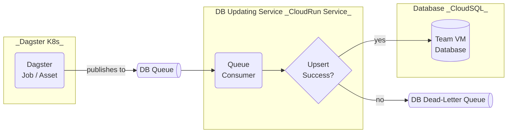

Hello, these are some ideas on connecting a database with a pipeline.

### Key Features

- If the DB is down, the job/asset will fail. This will not happen if the job/asset only needs to write to a queue.
- Queue consumer can contain logic to batch upserts when writing to the DB, reducing the number of calls made.
- Write to DLQ if the DB upserting fails, allowing inspection and possibly manually updating the DB.
